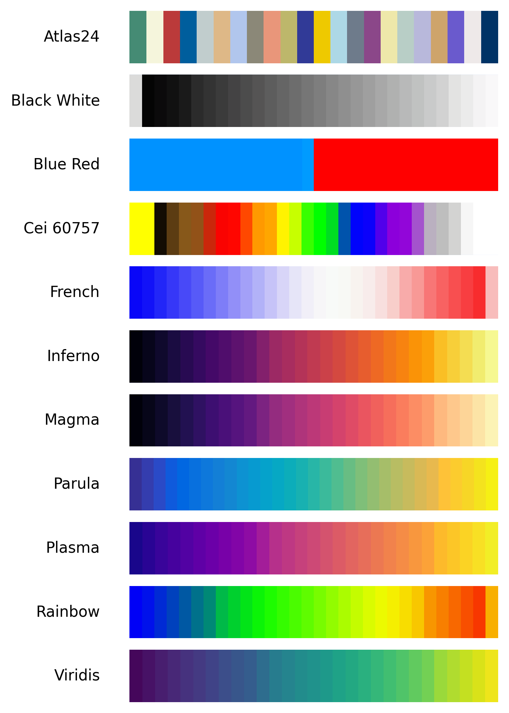

# Custom Colormap Toolkit

Utilities and resources for working with a curated set of scientific colormaps.
The repository packages the original `.xpm` palette definitions together with
Python helpers so you can load, sample, and register the colormaps in any
Matplotlib workflow. The current available color maps are:
<p align="center">
  <a>
    
  </a>
</p>

## Contents

- `colormaps/` – raw XPM files sourced from [https://bids.github.io/colormap/](https://bids.github.io/colormap/) and other custom colormaps.
- `colormap_utils.py` – parses the palettes, exposes helper APIs, and can register them with Matplotlib
- `colormap_gallery.py` – generates a labeled gallery figure (`Plots/custom_colormaps_gallery.png`)
- `ColormapUsage.ipynb` – notebook showing typical usage patterns
- `samplePlottingHelper.py` – contains several helpers including setting figure size according to journal requirements, comprehensive rcParams setup of matplotlib, different color palettes and marker styles for generating high-quality journal figures
- `Plots/` – generated figures (gallery or other outputs)

## Requirements

- Python 3.9+
- `matplotlib` and `numpy`

Install dependencies with:

```powershell
pip install matplotlib numpy
```

## Quick Start

```python
from colormap_utils import (
    list_available_colormaps,
    get_colormap,
    create_normalizer,
    map_values,
    register_with_matplotlib,
)

# 1. Discover available palettes for e.g. seed_seed_visualization.cmap_name
names = list_available_colormaps()
print(names)         # ('black_white', 'blue_red', 'cei_60757', ...)

# 2. Fetch one by name (case-insensitive)
cmap = get_colormap("viridis")

# 3. Map your data to RGBA colors with autorange or explicit min/max
weights = [0.2, 0.5, 0.9]
colors = map_values(weights, "plasma", vmin=0.0, vmax=1.0)

# 4. (Optional) Register all custom palettes globally
register_with_matplotlib(prefix="custom_")
# Now you can call plt.get_cmap("custom_magma")
```

To integrate with other scripts (e.g., `seed_seed_visualization.py`), supply any
name from `list_available_colormaps()` to the `cmap_name` argument.

## Gallery Figure

Run the gallery script to visualize every palette side by side:

```powershell
python colormap_gallery.py
```

This writes `Plots/custom_colormaps_gallery.png`, where each bar is labeled with
its corresponding colormap name for easy reference.

## Notebook

Open `ColormapUsage.ipynb` for interactive examples covering:

- Listing and sampling palettes
- Registering custom colormaps with Matplotlib
- Using `map_values` to color scatter/mesh plots
- Reproducing the gallery programmatically

Feel free to extend the notebook with additional workflows specific to your
projects before committing them to the repository.
